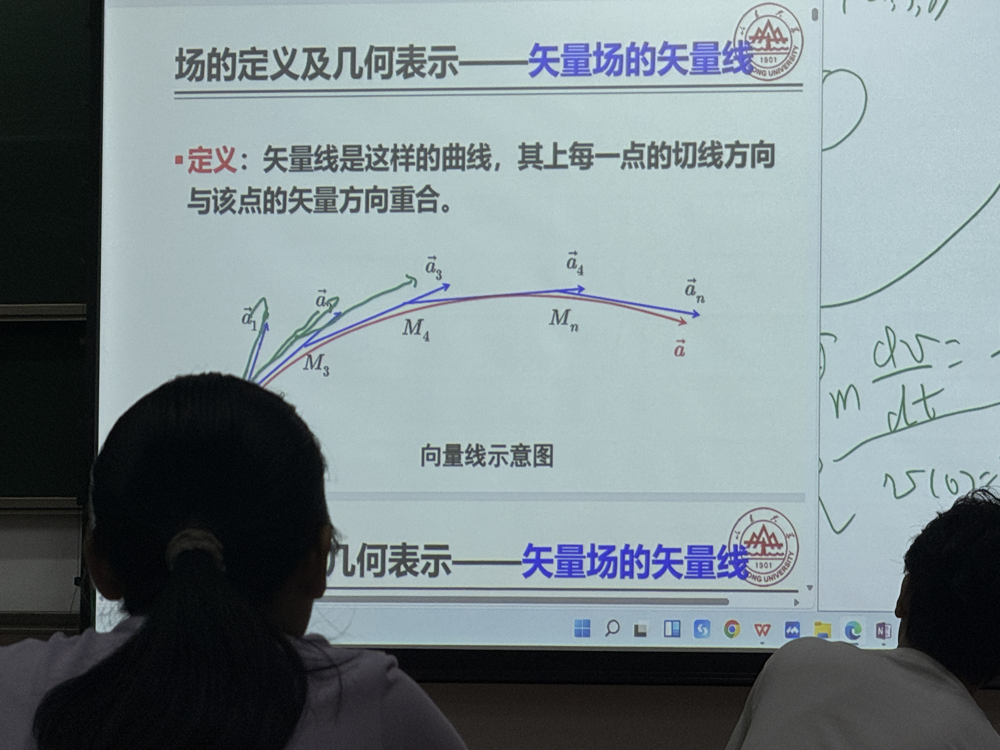
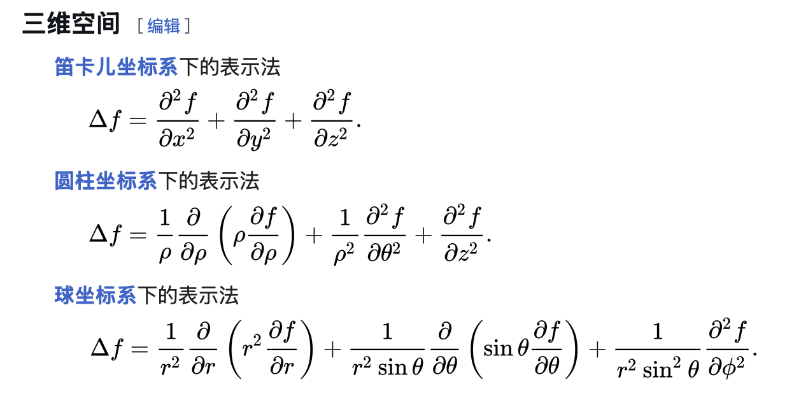

# 场论

Def. 场是物理量在空间中的分布. 一般会随着时间变化而变化. 

分类: 

- 标量场: 如温度场, 电位场
- 矢量场: 流速场, 重力场
- 张量场: 应力场, 应变场

数学上, 
$$
矢量场: \varphi(x,y,z), \varphi(x,y,z,t) \\
矢量场: \vec a(x,y,z), \vec a(x,y,z,t)
$$
与时间变量无关: 稳态场($\varphi(x,y,z)$)

与空间变量无关: 均匀场($\varphi(t)$)

## 等值面

Def. 等值面是$\varphi(x,y,z)=C$

Thm. 等值面互不相交. 

Def. 矢量线是每一点的切线方向与该点矢量方向重合的曲线. 

求解矢量线(取一小段$\vec r + d\vec r = \vec {r'}$): 
$$
\vec a // d\vec r \Leftrightarrow \vec a \times d\vec r =0 \\
即 \dfrac{dx}{a_x(x,y,z)} = \dfrac{dy}{a_y(x,y,z)} = \dfrac{dz}{a_x(x,y,z)} (这里a_x是函数)\\
F(x,y,z) = \dfrac{dx}{a_x(x,y,z)} - \dfrac{dy}{a_y(x,y,z)} = 0\\ 
G(x,y,z) = 0
$$
Def. 标量场的方向导数: $\dfrac{\partial \varphi}{\partial \vec s} = \lim_{|MM_0|\rightarrow 0} \dfrac{\varphi(M) - \varphi(M_0)}{|MM_0|}$

## 梯度, 散度, 旋度

Def. 梯度: $grad\ \varphi = \dfrac{\partial \varphi}{\partial n}\vec {n_0}$. $\vec {n_0}$是等值线的单位法向量, 指向值变化最大的方向. 梯度是一个向量, 可被拆解为
$$
\dfrac{\partial \varphi}{\partial x}\vec i + 
\dfrac{\partial \varphi}{\partial y}\vec j + 
\dfrac{\partial \varphi}{\partial z}\vec k
$$
Def. 通量: $\oint \vec ad\vec S$

Def. 散度: $div\ \vec a = \lim_{V\rightarrow 0}\dfrac{\oint \vec d\vec S}{V}$

Thm. 散度表达式: $div\ \vec a = \dfrac{\partial a_x}{x} +  \dfrac{\partial a_y}{y} + \dfrac{\partial a_z}{z}$

Def. 哈密顿算子 $\nabla = \vec i\dfrac{\partial }{\partial x} + \vec j\dfrac{\partial }{\partial y} + \vec k\dfrac{\partial }{\partial z} $. 哈密顿算子即可以用矢量分析, 也可以用微分分析

Def. 拉普拉斯算子$\Delta = \nabla \cdot \nabla = \dfrac{\partial^2}{\partial x^2}+ \dfrac{\partial^2}{\partial y^2} + \dfrac{\partial^2}{\partial z^2}$ , 可以看作先做梯度运算, 再做散度运算. 

Thm. 数乘: $\nabla \varphi = grad\ \varphi$

Thm. 点乘: $\nabla\cdot  \vec a = div\ \vec a$

Thm. 叉乘: $\nabla \times \vec a = rot\ \vec a$

## 坐标系

Def. 三条正交曲线组成的确定三维空间任意点的坐标的体系称为正交坐标系. 

分类: 

- 直角坐标系
- 球面坐标系
- 柱面坐标系

球面坐标系: 
$$
x = rsin\theta cos\phi \\ 
y = rsin\theta sin\phi \\
z = rcos\theta \\
$$
柱面坐标系: 
$$
x = \rho cos \varphi  \\ 
y = \rho sin \theta  \\ 
z = z
$$
 拉普拉斯算子在三种坐标系中的表示方法: 

## 弦振动方程 

### 问题

均匀柔软细弦的横振动问题. 

### 符号化

动量定理: 
$$
m\vec v|_{t=t_2} - m\vec v|_{t=t1} = \int_{t1}^{t2}\vec F_{合力}dt  \Rightarrow \\
\int_{t1}^{t2} \dfrac{d}{dt} \ m\vec v\  dt = \int_{t1}^{t2}\vec F_{合力}dt  \Rightarrow \\
\dfrac{d}{dt}m\vec v = \vec F_{合力}
$$
*固体一般用位移描述, 流体一般用速度*

质点标号: 用弦上质点在平衡位置的坐标$x$进行标号

曲线方程: $y = y(x,y)$

位移函数: $\vec u = (0, y(x,y))$

计算某一段弧上的物理量G: $\int_{B(t)} Gds = \int_{t1}^{t2}G(x,t)\sqrt{1+u_x^2}dx$

符号化各个物理量:
$$
位移: \vec u = (0, y(x,t)) \\
速度: \vec v = (t, u_t(x,t)) \\
线密度: \rho = \rho(x,t) \\ 
外力: \vec F = F(x,t) \\
张力: \vec T = T(x,t)\{\dfrac{1}{\sqrt{1+u_x^2}} + \dfrac{u_x}{\sqrt{1+u_x^2}}\}
$$
 张力的描述: 用分离体法, 对每一点将弦分为左右两部分, 分别考察. 实际上, 二者大小相同, 方向相反. 由于弦是柔软的, 则法向方向分量为0, 故张力方向一定与弦的当前位置的切线方向平行.

### 应用假设和推论

$$
\rho u_{tt} = Tu_{xx} + F(x,t)
$$

### 初始条件

$$
弦振动方程: u_{tt} - a^2u_{xx} = f(x,t) \\ 
初始位移: u = \varphi (x,t) \\ 
初始速度: u_t = \phi (x,t)
$$

## 输运方程

#### 普遍平衡定律

A在V内的**净改变率**等于**穿过边界区域的A的净通量**加上**区域内部的净产生率**
$$
\dfrac{\partial A}{\partial t} = -\nabla \vec J + Q
$$

